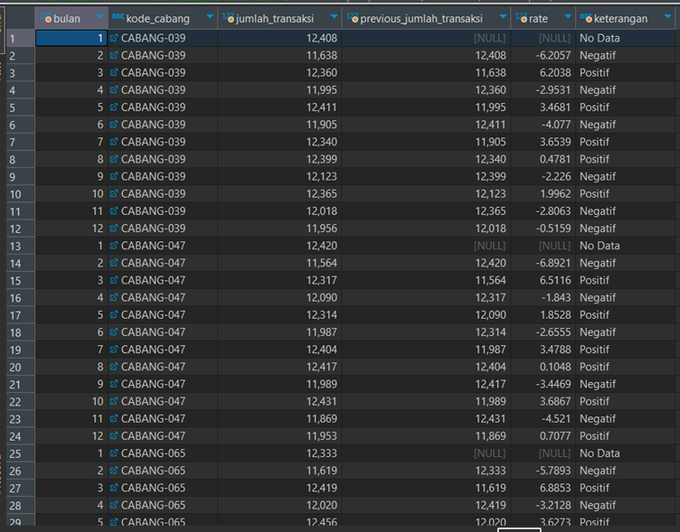

# 🏬 **Analyzing Minimart Data with SQL**
<br>

**Tool** : MySQL <br> 
**Dataset** : DQLab - [Minimart Data]()
<br>
<br>

**Table of Contents**
- [Problem Statement](https://github.com/sindyc28/SQL-Analyzing-Minimart-Data/blob/af663a3711c76949bd7ceb3c083bdab8b55f1aae/blob/main/README.md#-problem-statement)
	- [Background Story](https://github.com/sindyc28/SQL-Analyzing-Minimart-Data/blob/af663a3711c76949bd7ceb3c083bdab8b55f1aae/blob/main/README.md#background-story)
- [Data Preparation](https://github.com/sindyc28/SQL-Analyzing-Minimart-Data/blob/af663a3711c76949bd7ceb3c083bdab8b55f1aae/blob/main/README.md#-stage-1:-Data-Preparation)
	- [Create Database and ERD](https://github.com/sindyc28/SQL-Analyzing-Minimart-Data/blob/af663a3711c76949bd7ceb3c083bdab8b55f1aae/blob/main/README.md#create-database-and-erd)
- [Data Analysis](https://github.com/sindyc28/SQL-Analyzing-Minimart-Data/blob/af663a3711c76949bd7ceb3c083bdab8b55f1aae/blob/main/README.md#-data-analysis)
- [Summary No 8-11](https://github.com/sindyc28/SQL-Analyzing-Minimart-Data/blob/af663a3711c76949bd7ceb3c083bdab8b55f1aae/blob/main/README.md#-Summary-No-8---11)
<br>
<br>

## 📂 **Problem Statement**

### **Background Story**
Di tengah persaingan pasar ritel yang semakin ketat pengelolaan dan analisis data menjadi kunci sukses bagi perusahaan minimart. Data yang efektif dan efisien dapat memberikan wawasan yang berharga untuk pengambilan keputusan yang lebih baik, optimalisasi operasional, dan peningkatan kinerja bisnis secara keseluruhan. Minimart, sebagai bisnis ritel skala kecil hingga menengah, seringkali menghadapi tantangan dalam mengelola informasi pelanggan, persediaan produk, efisiensi operasional, dan lain-lain. Dalam proyek ini akan dilakukan analisis menggunakan data minimart dengan harapan perusahaan dapat mengoptimalkan operasional, meningkatkan penjualan, dan meraih keunggulan kompetitif
<br>
<br>

## 📂 **Data Preparation**

Dataset yang digunakan adalah dataset minimart yang memiliki informasi transaksi dengan jumlah 435183 dari tahun 2008. Terdapat fitur-titur yang membuat informasi seperti tanggal transaksi, jumlah pembelian, rincian produk, informasi karyawan(kasir) yang bertugas, infromasi kota dan cabang, dan lain-lain.

### **Create Database and ERD**
**Langkah-langkah yang dilakukan meliputi:**
1. Membuat workspace database
2. Melakukan import data csv kedalam database
3. Menentukan Primary Key atau Foreign Key \
4. Membuat dan mengeksport ERD (Entity Relationship Diagram) <br>

**Hasil ERD :** <br>
<p align="center">
  <kbd> </kbd> <br>
  Gambar 1. Entity Relationship Diagram
</p>
<br>
<br>

## 📂 **Data Analysis**
### **Task**
### **1. Menampilkan nama cabang dan nama kota yang punya data penjualan**

<details>
  <summary>Queries :</summary>

  ```sql
SELECT
	DISTINCT mc.nama_cabang ,
	nama_kota
FROM
	tr_penjualan tr
JOIN ms_cabang mc
ON
	tr.kode_cabang = mc.kode_cabang
JOIN ms_kota mk 
ON
	mc.kode_kota = mk.kode_kota 
```
</details>
<br>

**Result :**
<p align="center">
  <kbd> </kbd> <br>
<br>

### **2. Menampilkan nama cabang dan nama kota dari cabang yang tidak punya data penjualan di kota yang ada data penjualan (dari cabang lain)**

<details>
  <summary>Queries :</summary>

  ```sql
SELECT 
	nama_cabang , nama_kota
FROM ms_kota mk 
JOIN ms_cabang mc 
	ON mk.kode_kota = mc.kode_kota
WHERE mc.kode_cabang NOT IN 
	(SELECT kode_cabang FROM tr_penjualan tp) 
AND mk.kode_kota IN 
(
	SELECT DISTINCT mk2.kode_kota
	FROM tr_penjualan tp2 
	JOIN ms_cabang mc2
		ON mc2.kode_cabang = tp2.kode_cabang
	JOIN ms_kota mk2
		ON mk2.kode_kota= mc2.kode_kota
)
  ```
</details>
<br>

**Result :**
<p align="center">
  <kbd> </kbd> <br>
  <br>

### **3. Menampilkan nama kota, group cabang yang berjualan dan group cabang yang tidak berjualan untuk kota yang ada data penjualan**

<details>
  <summary>Queries :</summary>
  
```sql
WITH table1 as
(SELECT
	nama_kota ,
	nama_cabang AS cabang_jualan
	FROM ms_cabang mc
	JOIN ms_kota mk ON mc.kode_kota = mk.kode_kota
	WHERE 
		mc.kode_cabang IN 
			(SELECT DISTINCT tp.kode_cabang 
			FROM tr_penjualan tp)
		AND 
		mc.kode_kota IN 
			(SELECT DISTINCT mc.kode_kota 
			FROM ms_cabang mc 
			WHERE mc.kode_cabang IN 
				(SELECT DISTINCT tp.kode_cabang 
				FROM tr_penjualan tp))
),
table2 AS (
SELECT
	nama_kota,
	group_concat(nama_cabang) AS cabang_tidak_jualan
	FROM ms_cabang mc
	JOIN ms_kota mk ON mc.kode_kota = mk.kode_kota
	WHERE 
		mc.kode_cabang NOT IN 
			(SELECT DISTINCT tp.kode_cabang 
			FROM tr_penjualan tp)
	AND 
		mc.kode_kota IN 
			(SELECT DISTINCT mc.kode_kota 
			FROM ms_cabang mc 
			WHERE mc.kode_cabang IN 
				(SELECT DISTINCT tp.kode_cabang 
				FROM tr_penjualan tp))
		GROUP BY nama_kota
)
SELECT 
	table1.*,
	cabang_tidak_jualan
FROM table1 
JOIN table2 ON table1.nama_kota = table2.nama_kota
```
</details>
<br>

**Result :**
<p align="center">
  <kbd> </kbd> <br>
<br>

### **4. Total produk yang dijual kasir 039-127 di tanggal 8 Agustus 2008**

<details>
  <summary>Queries :</summary>
  
```sql
SELECT count(DISTINCT kode_produk)  
FROM tr_penjualan 
WHERE kode_kasir = '039-127'
AND CAST(tgl_transaksi AS date) = '2008-01-01'
```
</details>
<br>

**Result :**
<p align="center">
  <kbd> </kbd> <br>
<br>

### **5. Total cabang di Provinsi Yogyakart**

<details>
  <summary>Queries :</summary>
  
```sql
SELECT
	count(kode_cabang) banyak_cabang
FROM
	ms_cabang mc
JOIN ms_kota mk ON
	mc.kode_kota = mk.kode_kota
JOIN ms_propinsi mp ON
	mp.kode_propinsi = mk.kode_propinsi
WHERE
	nama_propinsi LIKE "%Yogyakarta%"
```
</details>
<br>

**Result :**
<p align="center">
  <kbd> </kbd> <br>
<br>

### **6. Menampilkan total keuntungan yang didapat pada tanggal 8 Agustus 2008 pada cabang Makassar 01**

<details>
  <summary>Queries :</summary>
  
```sql
SELECT
	sum((harga_berlaku_cabang-mhh.modal_cabang-mhh.biaya_cabang)* jumlah_pembelian) AS Keuntungan
FROM
	tr_penjualan tp
JOIN ms_cabang mc 
ON
	tp.kode_cabang = mc.kode_cabang
JOIN ms_harga_harian mhh 
ON
	mhh.kode_cabang = mc.kode_cabang
WHERE
	mhh.kode_produk = tp.kode_produk
	AND CAST(tgl_transaksi AS DATE) = "2008-8-8"
	AND CAST(tgl_berlaku AS DATE ) = "2008-8-8"
	AND nama_cabang LIKE "%Makassar 01" 
```
</details>
<br>

**Result :**
<p align="center">
  <kbd> </kbd> <br>
<br>

### **7. Menampilkan total transaksi per–kasir, dan bandingkan dengan total per–cabang**

<details>
  <summary>Queries :</summary>
  
```sql
WITH tpk AS (
SELECT
	kode_cabang,
	kode_kasir,
	count(DISTINCT kode_transaksi) AS transaksi_per_kasir
FROM
	tr_penjualan tp
GROUP BY
	1, 2
),
tpc AS (
SELECT
	kode_cabang,
	count(DISTINCT kode_transaksi) transaksi_per_cabang
FROM
	tr_penjualan tp
GROUP BY 1
)
SELECT
	tpk.*,
	tpc.transaksi_per_cabang,
	(tpk.transaksi_per_kasir / tpc.transaksi_per_cabang)* 100 AS Percentage
FROM
	tpk
JOIN tpc ON
	tpk.kode_cabang = tpc.kode_cabang
ORDER BY tpk.kode_kasir
```
</details>
<br>

**Result :**
<p align="center">
  <kbd> </kbd> <br>
<br>

### **8. Menganalisi produk mana saja yang termasuk di grup yang memiliki sedikit penjualan dibandingkan dengan keseluruhan produk. Bagi menjadi 4 kelompok besar, dan filter 2 kelompok besar terbawah untuk melihat produk mana saja**

<details>
  <summary>Queries :</summary>
  
```sql
WITH A AS (
SELECT
	tp.kode_cabang,
	nama_produk,
	sum((harga_berlaku_cabang - modal_cabang - biaya_cabang )* jumlah_pembelian) Profit
FROM
	tr_penjualan tp
JOIN ms_harga_harian mhh 
ON
	(tp.kode_produk = mhh.kode_produk)
	AND (tp.tgl_transaksi = mhh.tgl_berlaku)
	AND (tp.kode_cabang = mhh.kode_cabang)
JOIN ms_produk mp 
ON
	mp.kode_produk = tp.kode_produk
GROUP BY 1, 2 
),
B AS (
SELECT
	*,
	NTILE(4) OVER(ORDER BY profit DESC) AS group_produk
FROM
	A
)
SELECT *
FROM B
WHERE B.group_produk > 2
```
</details>
<br>

**Result :**
<p align="center">
  <kbd> </kbd> <br>
<br>

### **9. Mengurutkan 3 kota dengan penjualan terbanyak, dihitung dengan melihat rate penjualan kota dibandingkan dengan keseluruhan toko selama 1 semester di 2008**

<details>
  <summary>Queries :</summary>
  
```sql
WITH A AS 
(
SELECT
	nama_kota,
	sum(jumlah_pembelian) jumlah_penjualan_cabang
FROM
	tr_penjualan tp
JOIN ms_cabang mc 
	ON
	mc.kode_cabang = tp.kode_cabang
JOIN ms_kota mk 
	ON
	mk.kode_kota = mc.kode_kota
WHERE
	CAST(tgl_transaksi AS DATE) >= "2008-01-01"
	AND CAST(tgl_transaksi AS DATE) <= "2008-06-30"
GROUP BY 1)
,B AS (
SELECT
	*,
	sum(A.jumlah_penjualan_cabang) OVER() AS jumlah_penjualan_seluruh_cabang
FROM A)
SELECT
	*,
	round((B.jumlah_penjualan_cabang / B.jumlah_penjualan_seluruh_cabang) * 100, 2) AS rate,
	RANK() OVER(ORDER BY (B.jumlah_penjualan_cabang / B.jumlah_penjualan_seluruh_cabang) * 100 DESC) urutan
FROM B
```
</details>
<br>

**Result :**
<p align="center">
  <kbd> </kbd> <br>
<br>

### **10. Membandingkan performa setiap cabang setiap bulannya selama 2008 dan melihat bagaimana trendnya untuk memonitor performa setiap cabang**

<details>
  <summary>Queries :</summary>
  
```sql
WITH A AS (
SELECT
	MONTH (CAST(tp.tgl_transaksi AS DATE)) bulan,
	tp.kode_cabang,
	count(tp.kode_cabang) jumlah_transaksi
FROM
	tr_penjualan tp
JOIN ms_cabang mc 
ON
	tp.kode_cabang = mc.kode_cabang
GROUP BY 1, 2
),
B AS (
SELECT
	*,
	LAG(jumlah_transaksi, 1) OVER(PARTITION BY kode_cabang
ORDER BY
	bulan) previous_jumlah_transaksi
FROM A)
SELECT
	*,
	((B.jumlah_transaksi-B.previous_jumlah_transaksi)/ B.previous_jumlah_transaksi)* 100 rate,
	CASE
		WHEN ((B.jumlah_transaksi-B.previous_jumlah_transaksi)/ B.previous_jumlah_transaksi)* 100 < 0 THEN "Negatif"
		WHEN ((B.jumlah_transaksi-B.previous_jumlah_transaksi)/ B.previous_jumlah_transaksi)* 100 > 0 THEN "Positif"
		ELSE "No Data"
	END AS keterangan
FROM B
```
</details>
<br>

**Result :**
<p align="center">
  <kbd> </kbd> <br>
<br>

### **11. Menampilkan top 3 karyawan dari setiap kota yang memiliki penjualan terbanyak selama semester 1 2008**

<details>
  <summary>Queries :</summary>
  
```sql
WITH transaksi_per_kasir AS (
SELECT DISTINCT  
	mk.nama_kota ,
	tp.kode_cabang ,
	tp.kode_kasir ,
	sum(tp.jumlah_pembelian) OVER (PARTITION BY tp.kode_cabang) transaksi_cabang,
	sum(tp.jumlah_pembelian) OVER (PARTITION BY tp.kode_kasir) transaksi_kasir
FROM
	tr_penjualan tp
JOIN ms_cabang mc ON
	tp.kode_cabang = mc.kode_cabang
JOIN ms_kota mk ON
	mk.kode_kota = mc.kode_kota
WHERE
	MONTH (tgl_transaksi) BETWEEN 1 AND 6
),
rate_table AS (
SELECT
	tpk.nama_kota,
	tpk.kode_kasir,
	(tpk.transaksi_kasir / tpk.transaksi_cabang * 100) AS rate
FROM
	transaksi_per_kasir tpk
),
urutan_table AS (
SELECT
	rt.nama_kota,
	concat(mkr.nama_depan, ' ', mkr.nama_belakang) full_name,
	rt.rate,
	ROW_NUMBER () OVER(PARTITION BY rt.nama_kota
ORDER BY
	rt.rate DESC) urutan
FROM
	rate_table AS rt
JOIN ms_karyawan mkr ON
	rt.kode_kasir = mkr.kode_karyawan
ORDER BY
	1
)
SELECT 
	ut.nama_kota,
	ut.full_name,
	round(ut.rate, 2) AS rate,
	ut.urutan
FROM
	urutan_table AS ut
WHERE 
	ut.urutan IN (1, 2, 3)
```
</details>
<br>

**Result :**
<p align="center">
  <kbd> </kbd> 
<br>
<br>


 
---

## 📂 **Summary No 8 - 11**
**Nomor 8 :** <br>
Produk dibagi menjadi 4 kelompok berdasarkan profitabilitasnya. Kelompok yang berisi produk dengan profit/penjualan tertinggi berada pada kelompok 1, kemudian disusul kelompok 2, 3, dan kelompok yang berisi produk dengan profit terendah adalah kelompok 4. Dalam analisis ini dapat dilihat bahwa produk di kelompok 3 dan 4 merupakan 2 kelompok dengan produk yang memiliki penjualan/profit terendah dibandingkan dengan produk di kelompok lain. Berdasarkan hasil atau list produk dengan profit terendah yang telah tertera, dikembalikan kepada tim yang berkaitan untuk mengevaluasi kembali apa  yang menjadi kekurangan dan mengambil keputusan serta strategi untuk meningkatkan penjualan produk-produk tersebut.

**Nomor 9 :** <br>
Dari dari data yang diberikan, terdapat 3 kota dengan penjualan terbanyak. Terlihat bahwa Surabaya memimpin dalam hal jumlah penjualan, diikuti oleh Jakarta Pusat dan Makassar. Rate penjualan antar kota yang dihasilkan tidak berbeda jauh yaitu Surabaya memiliki rate 33.42%, Jakarta Pusat memiliki rate 33.33%, dan Makassar memiliki rate 33,25%. Hal ini mungkin mengindikasikan efisiensi atau efektivitas yang berbeda dalam operasional atau strategi penjualan masing-masing kota.

**Nomor 10 :** <br>
Data yang dihasilkan menunjukkan jumlah transaksi bulanan untuk tiga cabang berbeda, CABANG-039, CABANG-047, dan CABANG-065. Ketiga cabang menunjukkan fluktuasi bulanan dalam jumlah transaksi dengan beberapa bulan menunjukkan pertumbuhan (ditandai sebagai "Positif") dan beberapa menunjukkan penurunan (ditandai sebagai "Negatif") dibandingkan dengan bulan sebelumnya. Kolom "rate" menggambarkan persentase perubahan dari bulan sebelumnya, dengan nilai NULL dan "No Data" menunjukkan tidak adanya data untuk perbandingan. Cabang 039 menunjukkan pola yang bervariasi dengan campuran bulan positif dan negatif, sedangkan untuk Cabang 047 dan CABANG-065, juga terlihat pola serupa tetapi dengan periode tanpa data di awal. Terdapat beberapa periode stabil dan beberapa dengan perubahan yang signifikan, menunjukkan bahwa performa transaksi bisa dipengaruhi oleh faktor musiman, promosi, atau kejadian pasar. Untuk analisis yang lebih komprehensif, akan berguna untuk memahami konteks di balik angka-angka ini, seperti kegiatan pemasaran, perubahan dalam operasional, atau faktor eksternal yang mungkin mempengaruhi pola transaksi.

**Nomor 11 :** <br>
Berdasarkan tabel yang dihasilkan dapat dilihat bahwa terdapat top 3 karyawan di masing-masing kota yang melakukan penjualan produk terbanyak. Di Jakarta Pusat, Kristina Damai memimpin dengan rate tertinggi diikuti oleh Eko Rukun dan Kusuma Dominik. Di Makassar, Ferdy Tenteram berada di posisi teratas, dengan Agus Dewangga dan Eriq Menawan mengikutinya. Sementara di Surabaya, Natali Menawan memiliki rate yang jauh lebih tinggi dibandingkan dengan dua orang lainnya di kota yang sama, Budi Tenteram dan Harum Selangit, yang memiliki rate yang sama. Rate  mencerminkan kinerja yang dihitung dari jumlah produk yang dijual 1 karyawan dibagi jumlah produk yang dijual seluruh karyawan di cabang tersebut.
